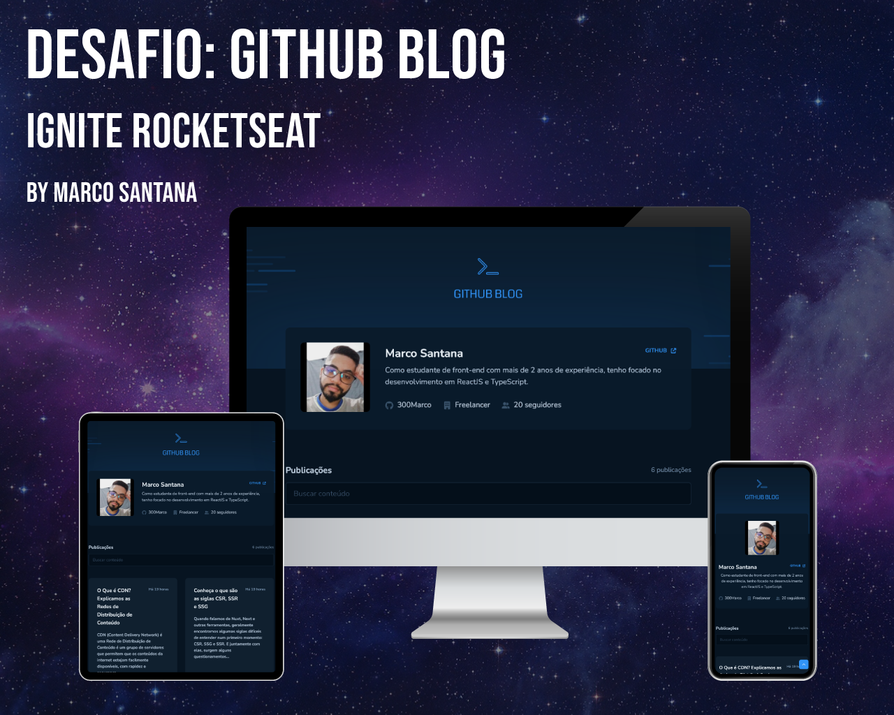

# Desafio Ignite Rocketseat - Github Blog

Este é um desafio onde precisamos praticar a utilização de clientes HTTP consumindo a API do Github. Os desafios da Rocketseat, nos ajudam a melhorar nossas habilidades práticas de desenvolvimento, para construir projetos realistas.

## Índice

- [Desafio Ignite Rocketseat - Github Blog](#desafio-ignite-rocketseat---github-blog)
  - [Índice](#índice)
  - [Visão Geral](#visão-geral)
    - [**Introdução**](#introdução)
    - [**Sobre o desafio**](#sobre-o-desafio)
    - [**Captura de tela - Versões Web e Mobile**](#captura-de-tela---versões-web-e-mobile)
    - [**Links**](#links)
  - [Meu processo](#meu-processo)
    - [**Construído com**](#construído-com)
    - [**O que eu aprendi**](#o-que-eu-aprendi)
      - [**Conhecimentos práticos aplicados durante o desenvolvimento**](#conhecimentos-práticos-aplicados-durante-o-desenvolvimento)
    - [**Desenvolvimento continuado**](#desenvolvimento-continuado)
    - [**Recursos úteis**](#recursos-úteis)
  - [Dev - Marco Santana](#dev---marco-santana)

## Visão Geral

### **Introdução**

Nesse desafio, vamos praticar a utilização de clientes HTTP consumindo a API do Github para criar um blog pessoal.

Como se trata de um desafio, ele necessita de alguns conhecimentos além dos abordados nesse módulo, então é importante que tenha autonomia para que consiga pesquisar essas coisas caso não saiba como resolver. Por isso, lembre-se, **tenha calma** e **acredite no seu processo.** O aprendizado daqui é muito importante, mas você com certeza vai conseguir sair daqui com muito conhecimento bacana.

### **Sobre o desafio**

Nesse desafio, você vai desenvolver uma aplicação que utilizará da API do GitHub para buscar issues de um repositório, dados do seu perfil e exibir elas como um blog.

- Listagem do seu perfil com imagem, número de seguidores, nome e outras informações disponíveis pela API do GitHub.
  
- Listar e filtrar todas as issues do repositório com um pequeno resumo do conteúdo dela
  
- Criar uma página para exibir um post (issue) completo

Apesar de serem poucas funcionalidades, você vai precisar relembrar conceitos como:

- Fetch / Axios
  
- Roteamento e React Router DOM
  
- Formulários

Para completar esse desafio você vai precisar fazer alguns preparativos e principalmente de algumas pesquisas para entender sobre a API do GitHub.

### **Captura de tela - Versões Web e Mobile**

### **Links**

- Site URL (Live): <a href="https://marco-github-blog.vercel.app" target="_blank">Github Blog</a>
  
- URL do Desafio: <a href="https://efficient-sloth-d85.notion.site/Desafio-03-Github-Blog-13593953670346908462ddc648d42cf1" target="_blank">Desafio 03 - Github Blog</a>

## Meu processo

### **Construído com**

- HTML5
- CSS3
- ReactJS + Vite
- JavaScript
- TypeScript

### **O que eu aprendi**

Neste desafio pude colocar em prática conhecimentos em ReactJS, adquiridos durante o terceiro módulo do curso no Ignite.

Foi um projeto desafiador, onde precisei buscar algumas soluções por fora, e isso me deu um maior poder de pesquisa e procura de resoluções.

Pude colocar em prática o que aprendi durante o módulo, sobre requisições HTTP, realizando buscas e filtrando resultados da API do github.

Desenvolvi uma melhor análise em relação ao que esta acontecendo na aplicação, quando utilizado **contexto no react**. Isso foi fundamental, pois aprendi melhor a como lidar com os dados, enquanto compartilho **funções** e **variáveis** no contexto.

A melhor parte foi ver tudo funcionando corretamente!!!

#### **Conhecimentos práticos aplicados durante o desenvolvimento**
- Estados
- ContextAPI
- Componentes
- React Hook Form
- Manipulação de Markdown
- Imutabilidade do estado
- Stitches CSS-in-JS
- Axios
- Requisições HTTP
- Propriedades
- Componentização

### **Desenvolvimento continuado**

Para o **quarto módulo**, o aprendizado será sobre **Next.js**. Irei desenvolver melhor minhas habilidades aplicadas no React.js + Vite.

O aprendizado é constante e, respeitar o tempo de aprendizado é importante. Irei focar nas tecnologias necessárias para resolver os problemas propostos.

### **Recursos úteis**

- [Um Guia completo para Flexbox](https://css-tricks.com/snippets/css/a-guide-to-flexbox/) - Gosto muito de utilizar o site do CSS-Tricks, para aprender sobre CSS, e utilizo muito esta página com dicas práticas de flexbox no CSS.
  
- [Minicurso Animações CSS](https://www.youtube.com/watch?v=eTELLTacg-8&t=2725s&ab_channel=dpw) - Este curso possui ensinamentos incríveis de animações com CSS, com ele pude aplicar animações simples na página, para deixa ela com mais classe.

## Dev - Marco Santana
 

  